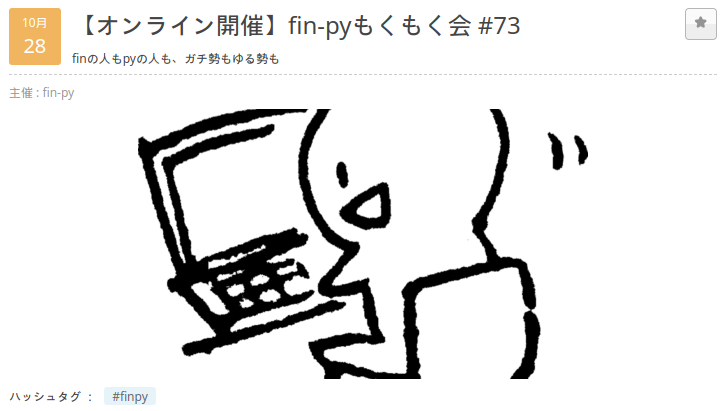
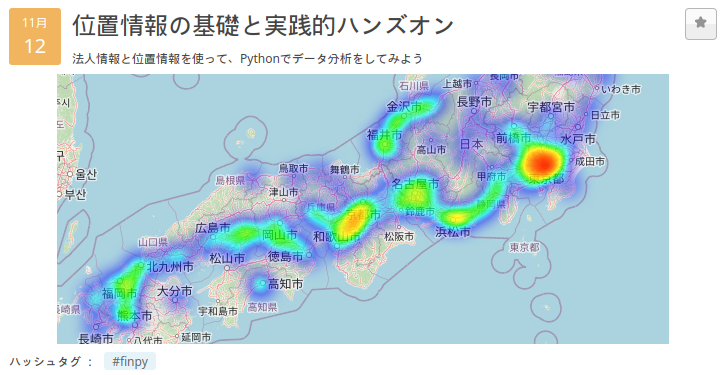

# 連絡事項

- 出席登録に入力をお願いします
    - https://fin-py.connpass.com/event/297060/
- イベント中の質問は音声・チャットどちらでもOKです
    - 発言時以外はミュートでお願いします
- イベント後の質問やご要望などはfin-pyのSlack `#derivatives`` までお願いします
    - Slackのリンクは [connpass](https://fin-py.connpass.com/event/297060/) の「参加者への情報」に記載しています
- イベント中のアンケートにご協力お願いします
- イベント中はなんらかのリアクションをいただけると励みになります
    - 質問
    - 感想、コメント
    - リアクションボタン

## 今後のイベント

### fin-pyもくもく会 #73

https://fin-py.connpass.com/event/298210/

### 位置情報の基礎と実践的ハンズオン

https://fin-py.connpass.com/event/298638/